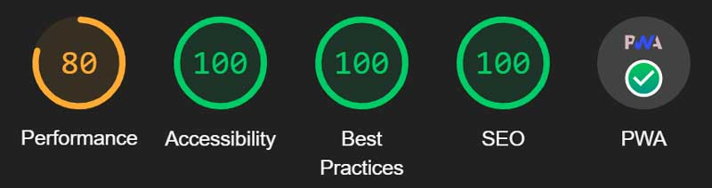

# sun-tracker

## Description
[Repo](https://github.com/escowin/sun-tracker) |
[Live URL](https://escowin.github.io/sun-tracker)
    
PWA that tracks Sun activity (coronal mass ejections, solar flares) with data provided by NASA's DONKI API. Current statistics are made within the OOP Sun class' methods using JavaScript to calculate formulas. TDD Jest testing was carried out on the Sun class to guarantee successful properties & methods.

Initially, this application was an exercise in JavaScript math, array iteration, ES6 synatx, DOM manipulation, and Third-Party API methods. Through Lighthouse audits & webpack configurations, I have further pushed my understanding of application optimization, offline functionality & PWA installability.

## Table of Contents
- [Installation](#installation)
- [Test](#test)
- [Usage](#usage)
- [Features](#features)
- [Credits](#credits)
- [Author](#author)

## Installation
- Open [live URL](https://escowin.github.io/sun-tracker) in browser. 
- On desktop, click 'Install solData' icon in address bar.
- On iOS, click 'Add to Home Screen'.

## Test
Run the following terminal command to run tests:
```
$ npm run test
```

## Usage


## Features
- Unit conversion (SI, Metric, Imperial)
- PWA Installation (see: [Installation](#installation))
- PWA Optimization


``````
Original : 54 | 100 | 100 | 91  | -
Current  : 80 | 100 | 100 | 100 | 1/1, 6/6
``````
## Credits
- Languages: HTML, CSS, JavaScript
- Libraries: [Day.js](https://day.js.org/), [jQuery](https://api.jquery.com/), [Jest](https://jestjs.io/), [webpack](https://github.com/webpack/webpack), et al.
- Databases: [DONKI (NASA API)](https://ccmc.gsfc.nasa.gov/tools/DONKI/), [CacheStorage](https://developer.mozilla.org/en-US/docs/Web/API/CacheStorage)
- Graphics: [Adobe Illustrator](https://www.adobe.com/products/illustrator.html)

## Author
### Edwin Escobar
- [Email](mailto:edwin@escowinart.com)
- [GitHub](https://github.com/escowin)
