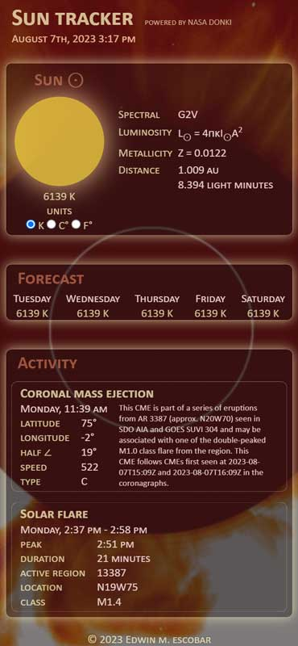
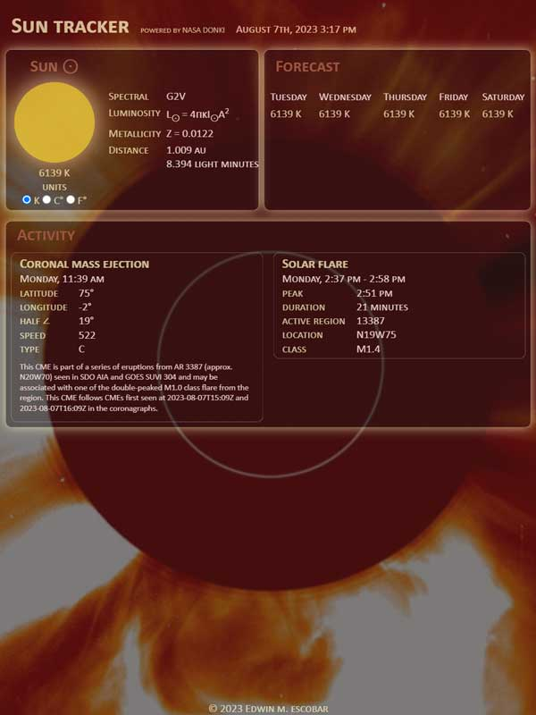
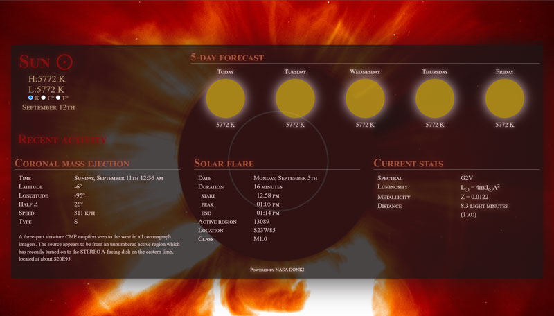

# sun-tracker

## Description
[Repo](https://github.com/escowin/sun-tracker) |
[Live URL](https://escowin.github.io/sun-tracker)
    
PWA that tracks Sun activity (coronal mass ejections, solar flares) with data provided by NASA's DONKI API. Methods performed on `Math` namespace object to calculate current stats and to convert between SI, metric, and imperial measurements. Web API

Initially, this application was an exercise in JavaScript math, array iteration, ES6 synatx, DOM manipulation, and Third-Party API methods. Through Lighthouse audits & webpack configurations, I have further pushed my understanding of application optimization, offline functionality & PWA installability.

## Table of Contents
- [Installation](#installation)
- [Test](#test)
- [Usage](#usage)
- [Features](#features)
- [Credits](#credits)
- [Author](#author)

## Installation
- Open [live URL](https://escowin.github.io/sun-tracker) in browser. 
- On desktop, click 'Install solData' icon in address bar.
- On iOS, click 'Add to Home Screen'.

## Usage







## Features
- PWA installation (see: [Installation](#installation))
- Lighthouse Audit: 
``````
Original : 54 | 100 | 100 | 91 | -
Current  : 80 | 100 | 100 | 100 | 1/1, 6/6
``````

## Credits
- Languages: HTML, CSS, JavaScript
- Libraries: [Day.js](https://day.js.org/), [jQuery](https://api.jquery.com/), [webpack](https://github.com/webpack/webpack), et al.
- Databases: [DONKI (NASA API)](https://ccmc.gsfc.nasa.gov/tools/DONKI/), Cache Storage
- Graphics: [Adobe Illustrator](https://www.adobe.com/products/illustrator.html)

## Author
### Edwin Escobar
- [Email](mailto:edwin@escowinart.com)
- [GitHub](https://github.com/escowin)
