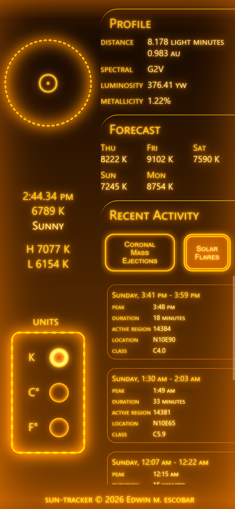
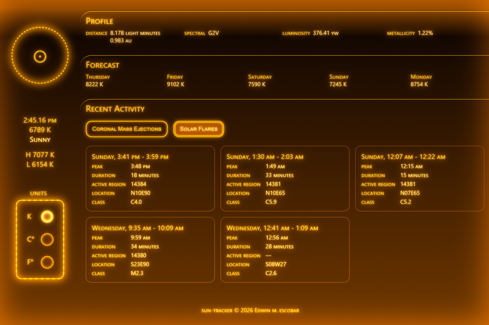
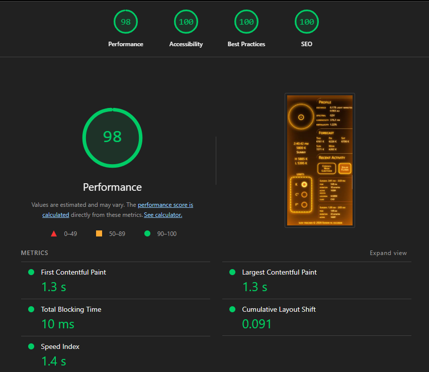

# sun-tracker

## Description
[Repo](https://github.com/escowin/sun-tracker) |
[Live URL](https://escowin.github.io/sun-tracker)

A **lightweight** PWA that tracks Sun activity—coronal mass ejections and solar flares—powered by **NASA's DONKI API**. A humorous take on "weather forecasting" for the Sun: native JavaScript math formulas generate random temperatures and calculate precise Earth–Sun distances in real time. Because why not forecast the star that makes all forecasts possible?

### Highlights

- **Third-party API** — Real solar event data (CMEs, flares) from [NASA DONKI](https://ccmc.gsfc.nasa.gov/tools/DONKI/), with offline fallback via IndexedDB.

- **Legacy code by design** — Deliberately built with **jQuery** as an exercise in DOM manipulation, selectors, and working within constraints. No framework—just vanilla JS, OOP, and a healthy dose of `$()`.

- **Modern CSS, retro feel** — Mimics 1980s CRT displays with a monochrome palette, scan-line–inspired animations, and a glow that would make a VHS tape proud. Modern selectors and custom properties under the hood.

- **PWA capabilities** — Installable, offline-ready, and optimized for performance. Works when the grid goes down (or when you're just far from a cell tower).

- **The math** — The Sun class uses native JS to compute real-time distance (Earth–Sun varies ~147M–152M km), random-but-plausible "temps," and other stats. TDD with Jest keeps the formulas honest.

## Table of Contents
- [Data Flow](#data-flow)
- [Installation](#installation)
- [Test](#test)
- [Usage](#usage)
- [Features](#features)
- [Credits](#credits)
- [Author](#author)

## Data Flow

Data moves **API → Memory → Display**:

1. **API** (`API.js`) — Fetches CME and FLR data from NASA DONKI. Returns structured results with status handling: `{ ok, data?, status?, retryable? }`.

2. **Memory** (`Memory.js`) — Orchestrates fetch and IndexedDB:
   - On **successful fetch (200)**: Clears the corresponding store (`cme` or `flr`), writes new objects, and dispatches an update event.
   - On **retryable errors** (503, 400, network failure, etc.): Keeps existing store data and schedules a retry after 2 minutes.
   - On **non-retryable errors** (404, 401, 403): Keeps existing data; no retry (404 = URL not found, 401/403 = invalid API key).
   - IndexedDB stores are the **source of truth** for display.

3. **Display** (`Display.js`) — Reads from IndexedDB via `getStore()`, renders the activity list, and listens for `sundata-updated` to re-render when new data is written (e.g., after a retry).

## Installation
- Open [live URL](https://escowin.github.io/sun-tracker) in browser. 
- On desktop, click 'Install solData' icon in address bar.
- On iOS, click 'Add to Home Screen'.

## Test
Run the following terminal command to run tests:
```
$ npm run test
```

## Usage





## Features
- Unit conversion (SI, Metric, Imperial)
- PWA Installation (see: [Installation](#installation))
- PWA Optimization



```
Original : 54 | 100 | 100 | 91  | -
Current  : 98 | 100 | 100 | 100 | 1/1, 6/6
```
## Credits
- Languages: HTML, CSS, JavaScript
- Libraries: [Day.js](https://day.js.org/), [jQuery](https://api.jquery.com/), [Jest](https://jestjs.io/), [webpack](https://github.com/webpack/webpack), et al.
- Databases: [DONKI (NASA API)](https://ccmc.gsfc.nasa.gov/tools/DONKI/), [indexedDB](https://developer.mozilla.org/en-US/docs/Web/API/IndexedDB_API)
- Graphics: [Adobe Illustrator](https://www.adobe.com/products/illustrator.html)

## Author
### Edwin Escobar
- [Email](mailto:edwin@escowinart.com)
- [GitHub](https://github.com/escowin)
